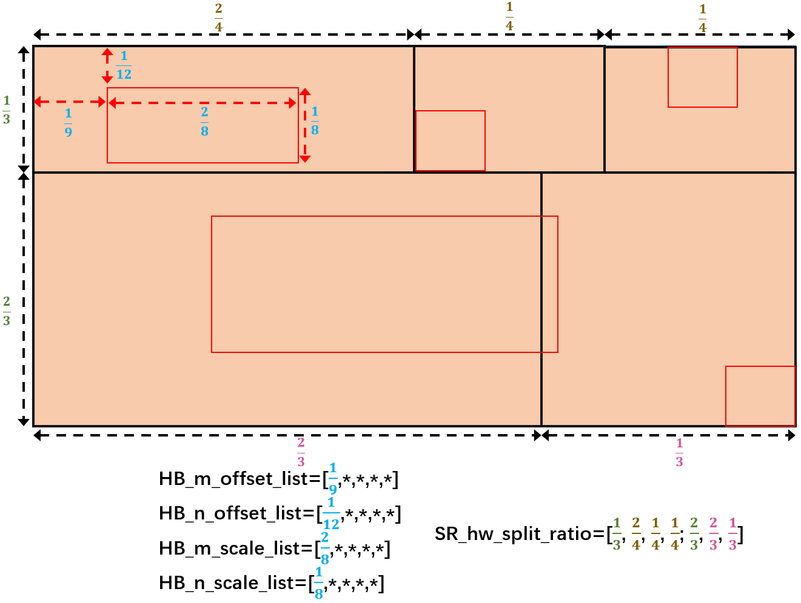
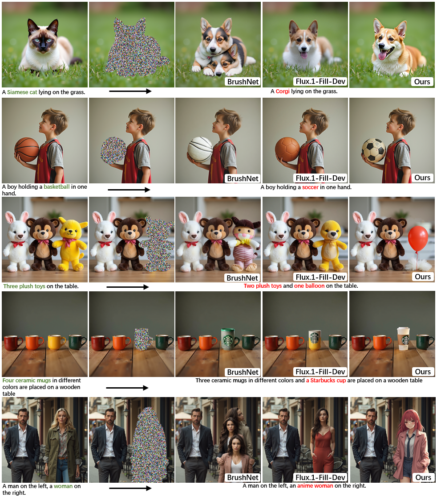
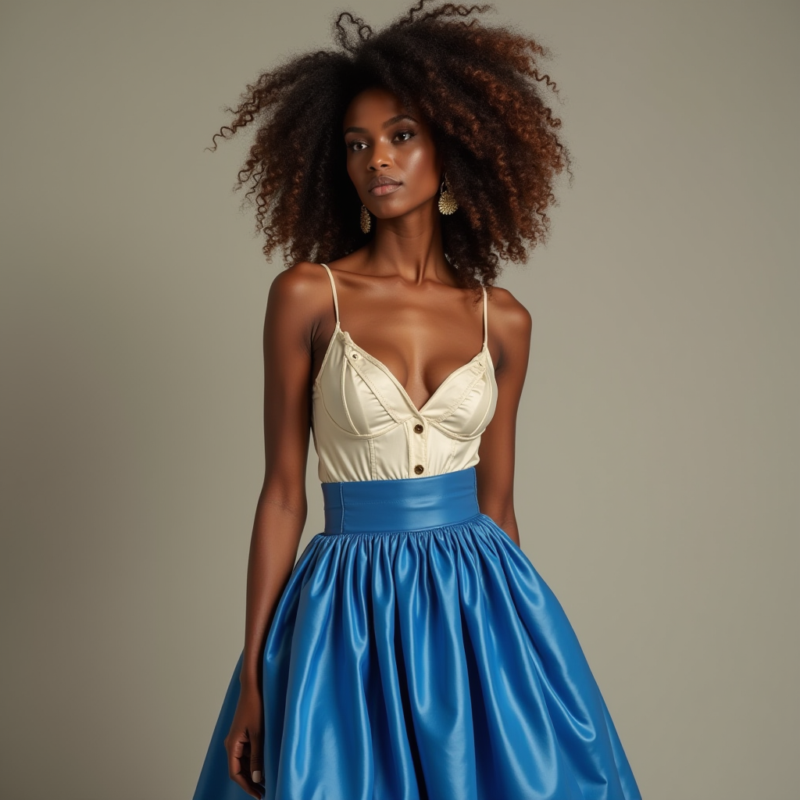

<div align="center">

<h1> Region-Aware Text-to-Image Generation via Hard Binding and Soft Refinement </h1>

[**Zhennan Chen**](#)<sup>1*</sup> · [**Yajie Li**](#)<sup>1*</sup> · [**Haofan Wang**](https://haofanwang.github.io/)<sup>2,3</sup> · [**Zhibo Chen**](#)<sup>3</sup> · [**Zhengkai Jiang**](https://jiangzhengkai.github.io/)<sup>4</sup> · [**Jun Li**](https://sites.google.com/view/junlineu/)<sup>1</sup> · [**Qian Wang**](#)<sup>5</sup> · [**Jian Yang**](https://scholar.google.com/citations?user=6CIDtZQAAAAJ&hl=zh-CN&oi=ao)<sup>1</sup> ·[**Ying Tai**](https://tyshiwo.github.io/)<sup>1✉</sup>

<sup>1</sup>Nanjing University · <sup>2</sup>InstantX Team · <sup>3</sup>Liblib AI · <sup>4</sup>HKUST · <sup>5</sup>China Mobile

<a href='https://arxiv.org/abs/2411.06558'></a>
<a href='https://huggingface.co/spaces/NJU/RAG-Diffusion'></a>
</div>

<table class="center">
  <tr>
    <td width=100% style="border: none"></td>
  </tr>
</table>

We present **RAG**, a **R**egional-**A**ware text-to-image **G**eneration method conditioned on regional descriptions for precise layout composition. Regional prompting, or compositional generation, which enables fine-grained spatial control, has gained increasing attention for its practicality in real-world applications. However, previous methods either introduce additional trainable modules, thus only applicable to specific models, or manipulate on score maps within cross-attention layers using attention masks, resulting in limited control strength when the number of regions increases. To handle these limitations, we decouple the multi-region generation into two sub-tasks, the construction of individual region (**Regional Hard Binding**) that ensures the regional prompt is properly executed, and the overall detail refinement (**Regional Soft Refinement**) over regions that dismiss the visual boundaries and enhance adjacent interactions. Furthermore, RAG novelly makes repainting feasible, where users can modify specific unsatisfied regions in the last generation while keeping all other regions unchanged, without relying on additional inpainting models. Our approach is tuning-free and applicable to other frameworks as an enhancement to the prompt following property. Quantitative and qualitative experiments demonstrate that RAG achieves superior performance over attribute binding and object relationship than previous tuning-free methods. 

## News ##
- **2025.06.26**: 🏆 Our work is accepted by ICCV 2025!
- **2024.12.23**: 🍎 RAG-Diffusion now supports [**FLUX.1-dev-IP-Adapter**](https://huggingface.co/InstantX/FLUX.1-dev-IP-Adapter) and [**PuLID**](https://github.com/ToTheBeginning/PuLID)!
- **2024.11.29**: 🎯 RAG-Diffusion now supports [**FLUX.1 Redux**](https://huggingface.co/black-forest-labs/FLUX.1-Redux-dev)!
- **2024.11.27**: 📢 Repainting code is released.
- **2024.11.20**: 👉 RAG Online Demo is Live. Try it now! ([**Link**](https://huggingface.co/spaces/NJU/RAG-Diffusion))
- **2024.11.12**: 🚀 Our code and technical report are released.


## Text-to-Image Generation
### 1. Set Environment
```bash
conda create -n RAG python==3.9
conda activate RAG
pip install xformers==0.0.28.post1 diffusers peft torchvision==0.19.1 opencv-python==4.10.0.84 sentencepiece==0.2.0 protobuf==5.28.1 scipy==1.13.1
```
### 2. Quick Start
```python
import torch
from RAG_pipeline_flux import RAG_FluxPipeline

pipe = RAG_FluxPipeline.from_pretrained("black-forest-labs/FLUX.1-dev", torch_dtype=torch.bfloat16)
pipe = pipe.to("cuda")


prompt = "a balloon on the bottom of a dog"
HB_replace = 2
HB_prompt_list =  [
        "Balloon",
        "Dog"
    ]
HB_m_offset_list =  [
        0.1,
        0.1
    ]
HB_n_offset_list =  [
        0.55,
        0.05
    ]
HB_m_scale_list =  [
        0.8,
        0.8
    ]
HB_n_scale_list = [
        0.4,
        0.45
    ]
SR_delta = 1.0
SR_hw_split_ratio = "0.5; 0.5"
SR_prompt = "A playful dog, perhaps a golden retriever, with its ears perked up, sitting on the balloon, giving an enthusiastic demeanor. BREAK A colorful balloon floating gently, its string dangling gracefully, just beneath the dog."
height, width = 1024, 1024
seed = 1234

image = pipe(
    SR_delta=SR_delta,
    SR_hw_split_ratio=SR_hw_split_ratio,
    SR_prompt=SR_prompt,
    HB_prompt_list=HB_prompt_list,
    HB_m_offset_list=HB_m_offset_list,
    HB_n_offset_list=HB_n_offset_list,
    HB_m_scale_list=HB_m_scale_list,
    HB_n_scale_list=HB_n_scale_list,
    HB_replace=HB_replace,
    seed=seed,
    prompt=prompt,
    height=height,
    width=width,
    num_inference_steps=20,
    guidance_scale=3.5,
).images[0]

filename = "RAG.png"
image.save(filename)
print(f"Image saved as {filename}")
```
- `HB_replace` (`int`):
  The times of hard binding. More times can make the position control more precise, but may lead to obvious boundaries.
- `HB_prompt_list` (`List[str]`):
  Fundamental descriptions for each individual region or object.
- `HB_m_offset_list`, `HB_n_offset_list`, `HB_m_scale_list`, `HB_n_scale_list`(`List[float]`):
  Corresponding to the coordinates of each fundamental prompt in HB_prompt_list.
- `SR_delta` (`float`):
  The fusion strength of image latent and regional-aware local latent. This is a flexible parameter, you can try 0.25, 0.5, 0.75, 1.0.
- `SR_prompt` (`str`):
  Highly descriptive sub-prompts for each individual region or object. Each sub-prompt is separated by *BREAK*.
- `SR_hw_split_ratio` (`str`):
  The global region divisions correspond to each highly descriptive sub-prompt in SR_prompt.

<details open>
<summary>The following shows several schematic diagrams of `HB_m_offset_list`, `HB_n_offset_list`, `HB_m_scale_list`, `HB_n_scale_list`, `SR_hw_split_ratio`.</summary> 
<table class="center">
  <tr>
    <td width=25% style="border: none"></td>
    <td width=25% style="border: none"></td>
    <td width=25% style="border: none"></td>

  <!-- <tr>
    <td width="25%" style="border: none; text-align: center; word-wrap: break-word">HB_m_offset_list=[<font color="rgb(0,176,240)">1/9</font>, *, *, *, *], HB_n_offset_list=[<font color="rgb(0,176,240)">1/12</font>, *, *, *, *], HB_m_scale_list=[<font color="rgb(0,176,240)">2/4</font>, *, *, *, *], HB_n_scale_list[<font color="rgb(0,176,240)">1/8</font>, *, *, *, *], 
    SR_hw_split_ratio=[<font color="rgb(84,130,53)">1/3</font>, <font color="rgb(127,96,0)">2/4</font>, <font color="rgb(127,96,0)">1/4</font>, <font color="rgb(127,96,0)">1/4</font>; <font color="rgb(84,130,53)">2/3</font>, <font color="rgb(217,83,153)">2/3</font>, <font color="rgb(217,83,153)">1/3</font>] </td>
    <td width="25%" style="border: none; text-align: center; word-wrap: break-word">SR_hw_split_ratio=[<font color="rgb(127,96,0)">1/6</font>, <font color="rgb(127,96,0)">2/6</font>, <font color="rgb(127,96,0)">3/6</font>]</td>
    <td width="25%" style="border: none; text-align: center; word-wrap: break-word">SR_hw_split_ratio=[<font color="rgb(127,96,0)">1/2</font>, <font color="rgb(127,96,0)">1/2</font>]</td>

  </tr> -->
</table>
</details>

### 3. RAG with MLLM
```python
import torch
from RAG_pipeline_flux import RAG_FluxPipeline
from RAG_MLLM import local_llm, GPT4

pipe = RAG_FluxPipeline.from_pretrained("black-forest-labs/FLUX.1-dev", torch_dtype=torch.bfloat16)
pipe = pipe.to("cuda")

prompt = "A small elephant on the left and a huge rabbit on the right."

para_dict = GPT4(prompt,key='')
print(para_dict)

HB_replace = 2
HB_prompt_list =  para_dict["HB_prompt_list"]
HB_m_offset_list = eval(para_dict["HB_m_offset_list"])
HB_n_offset_list = eval(para_dict["HB_n_offset_list"])
HB_m_scale_list = eval(para_dict["HB_m_scale_list"])
HB_n_scale_list = eval(para_dict["HB_n_scale_list"])
SR_delta = 1.0
SR_hw_split_ratio = para_dict["SR_hw_split_ratio"]
SR_prompt = para_dict["SR_prompt"]
height = 1024
width = 1024
seed = 1234

image = pipe(
    SR_delta=SR_delta,
    SR_hw_split_ratio=SR_hw_split_ratio,
    SR_prompt=SR_prompt,
    HB_prompt_list=HB_prompt_list,
    HB_m_offset_list=HB_m_offset_list,
    HB_n_offset_list=HB_n_offset_list,
    HB_m_scale_list=HB_m_scale_list,
    HB_n_scale_list=HB_n_scale_list,
    HB_replace=HB_replace,
    seed=seed,
    prompt=prompt,
    height=height,
    width=width,
    num_inference_steps=20,
    guidance_scale=3.5,
).images[0]

filename = "RAG.png"
image.save(filename)
print(f"Image saved as {filename}")
```


## Gallery

### 1. Image Inference

<details open>
<summary>Examples</summary> 
<table class="center">
  <tr>
    <td width=100% style="border: none"></td>
  </tr>
  <tr>
    <td width="100%" style="border: none; text-align: center; word-wrap: break-word">On the left, Einstein is painting the Mona Lisa; in the center, Elon Reeve Musk is participating in the U.S. presidential election; on the right, Trump is hosting a Tesla product launch.</td>
  </tr>
  <tr>
    <td width="50%" style="border: none; text-align: center; word-wrap: break-word">
      <pre style="background-color: #f4f4f4; padding: 10px; border-radius: 5px; font-family: Consolas, monospace; font-size: 16px; display: inline-block;">python RAG.py --idx=0</pre>
    </td>
    </td>
  </td>
  </table>
  <table class="center">
  <tr>
    <td width=100% style="border: none"></td>
  </tr>
  <tr>
    <td width="100%" style="border: none; text-align: center; word-wrap: break-word">On the left, a penguin wearing sunglasses is sunbathing in the desert; in the center, a tiger wearing a scarf is standing on a glacier; on the right, a panda in a windbreaker is walking through the forest.</td>
  </tr>
  <tr>
    <td width="50%" style="border: none; text-align: center; word-wrap: break-word">
      <pre style="background-color: #f4f4f4; padding: 10px; border-radius: 5px; font-family: Consolas, monospace; font-size: 16px; display: inline-block;">python RAG.py --idx=1</pre>
    </td>
    </td>
  </tr>
</table>
<table class="center">
  <tr>
    <td width=25% style="border: none"></td>
    <td width=25% style="border: none"></td>
    <td width=25% style="border: none"></td>
    <td width=25% style="border: none"></td>
  </tr>
  <tr>
    <td width="25%" style="border: none; text-align: center; word-wrap: break-word">Seven ceramic mugs in different colors are placed on a wooden table, with numbers from 1 to 7 written on the cups, and a bunch of white roses on the left.</td>
    <td width="25%" style="border: none; text-align: center; word-wrap: break-word">A balloon on the bottom of a dog.</td>
    <td width="25%" style="border: none; text-align: center; word-wrap: break-word">A cylindrical glass, obscuring the right half of the apple behind it.</td>
    <td width="25%" style="border: none; text-align: center; word-wrap: break-word"> From left to right, Pink blossoming trees, Green sycamore trees, Golden maples and Snow-blanketed pines.</td>
  </tr>
  <tr>
    <td width="25%" style="border: none; text-align: center; word-wrap: break-word">
      <pre style="background-color: #f4f4f4; padding: 10px; border-radius: 5px; font-family: Consolas, monospace; font-size: 16px; display: inline-block;">python RAG.py --idx=2</pre>
    </td>
    <td width="25%" style="border: none; text-align: center; word-wrap: break-word">
      <pre style="background-color: #f4f4f4; padding: 10px; border-radius: 5px; font-family: Consolas, monospace; font-size: 16px; display: inline-block;">python RAG.py --idx=3</pre>
    </td>
    <td width="25%" style="border: none; text-align: center; word-wrap: break-word">
      <pre style="background-color: #f4f4f4; padding: 10px; border-radius: 5px; font-family: Consolas, monospace; font-size: 16px; display: inline-block;">python RAG.py --idx=4</pre>
    </td>
    <td width="25%" style="border: none; text-align: center; word-wrap: break-word">
      <pre style="background-color: #f4f4f4; padding: 10px; border-radius: 5px; font-family: Consolas, monospace; font-size: 16px; display: inline-block;">python RAG.py --idx=5</pre>
    </td>
  </tr>
</table>
</details>
   

### 2. Image Repainting
```python
from RAG_pipeline_flux import RAG_FluxPipeline
import argparse
import torch
from PIL import Image
import json

pipe = RAG_FluxPipeline.from_pretrained("black-forest-labs/FLUX.1-dev", torch_dtype=torch.bfloat16)
pipe = pipe.to("cuda")

prompt = "A vase and an apple."
HB_replace = 2
HB_prompt_list =  [
    "Vase",
    "Apple"
]
HB_m_offset_list = [
    0.05,
    0.65
]
HB_n_offset_list = [
    0.1,
    0.25
]
HB_m_scale_list = [
    0.5,
    0.3
]
HB_n_scale_list = [
    0.8,
    0.5
]
SR_delta = 0.5
SR_hw_split_ratio = "0.6, 0.4"
SR_prompt = "A beautifully crafted vase, its elegant curves and floral embellishments standing prominently on the left side. Its delicate design echoes a sense of timeless artistry. BREAK On the right, a shiny apple with vibrant red skin, enticing with its perfectly smooth surface and hints of green around the stem."
height = 1024
width = 1024
seed = 1202

Repainting_prompt = "A vase and a Rubik's Cube."
Repainting_SR_prompt = "A beautifully crafted vase, its elegant curves and floral embellishments standing prominently on the left side. Its delicate design echoes a sense of timeless artistry. BREAK On the right, a vibrant Rubik's Cube, with its distinct colorful squares, sitting next to the vase, adding a playful and dynamic contrast to the still life composition."
Repainting_HB_prompt = "Rubik's Cube"
Repainting_mask = Image.open("data/Repainting_mask/mask_6.png").convert("L") 
Repainting_HB_replace = 3
Repainting_seed = 100
Repainting_single = 0


image, Repainting_image_output = pipe(
        SR_delta=SR_delta,
        SR_hw_split_ratio=SR_hw_split_ratio,
        SR_prompt=SR_prompt,
        HB_prompt_list=HB_prompt_list,
        HB_m_offset_list=HB_m_offset_list,
        HB_n_offset_list=HB_n_offset_list,
        HB_m_scale_list=HB_m_scale_list,
        HB_n_scale_list=HB_n_scale_list,
        HB_replace=HB_replace,
        seed=seed,
        Repainting_mask=Repainting_mask,
        Repainting_prompt=Repainting_prompt,
        Repainting_SR_prompt=Repainting_SR_prompt,
        Repainting_HB_prompt=Repainting_HB_prompt,
        Repainting_HB_replace=Repainting_HB_replace,
        Repainting_seed=Repainting_seed,
        Repainting_single=Repainting_single,
        prompt=prompt, 
        height=height, 
        width=width, 
        num_inference_steps=20, 
        guidance_scale=3.5
        )

image.images[0].save("RAG_Original.png")
Repainting_image_output.images[0].save("RAG_Repainting.png")
```
RAG showcases its image repainting capabilities, achieving competitive results against the latest [**Flux.1-Fill-Dev**](https://github.com/black-forest-labs/flux/blob/main/docs/fill.md) and [**BrushNet**](https://github.com/TencentARC/BrushNet).

<details open>
<summary>Example</summary>
<table class="center">
    <tr>
        <td style="border: none"></td>
        <td style="border: none"></td>
        <td style="border: none"></td>
    </tr>
    <tr>
        <td width="25%" style="border: none; text-align: center; word-wrap: break-word" colspan="3">Text prompt: "A vase and an apple."
        
Repainting prompt: "A vase and a Rubik's Cube."</td>
    </tr>
    <tr>
      <td width="100%" style="border: none; text-align: center; word-wrap: break-word" colspan="3">
        <pre style="background-color: #f4f4f4; padding: 10px; border-radius: 5px; font-family: Consolas, monospace; font-size: 16px; display: inline-block;">python RAG_Repainting.py --idx=0</pre>
      </td>
    </tr>
</table>

<table class="center">
    <tr>
        <td style="border: none"></td>
        <td style="border: none"></td>
        <td style="border: none"></td>
    </tr>
    <tr>
        <td width="25%" style="border: none; text-align: center; word-wrap: break-word" colspan="3">Text prompt: "Three plush toys on the table."
        
Repainting prompt: "Two plush toys and one balloon on the table."</td>
    </tr>
    <tr>
      <td width="100%" style="border: none; text-align: center; word-wrap: break-word" colspan="3">
        <pre style="background-color: #f4f4f4; padding: 10px; border-radius: 5px; font-family: Consolas, monospace; font-size: 16px; display: inline-block;">python RAG_Repainting.py --idx=1</pre>
      </td>
    </tr>
</table>

<table class="center">
    <tr>
        <td style="border: none"></td>
        <td style="border: none"></td>
        <td style="border: none"></td>
    </tr>
    <tr>
        <td width="25%" style="border: none; text-align: center; word-wrap: break-word" colspan="3">Text prompt: "A Siamese cat lying on the grass."
        
Repainting prompt: "A Corgi lying on the grass."</td>
    </tr>
    <tr>
      <td width="100%" style="border: none; text-align: center; word-wrap: break-word" colspan="3">
        <pre style="background-color: #f4f4f4; padding: 10px; border-radius: 5px; font-family: Consolas, monospace; font-size: 16px; display: inline-block;">python RAG_Repainting.py --idx=2</pre>
      </td>
    </tr>
</table>

<table class="center">
    <tr>
        <td style="border: none"></td>
        <td style="border: none"></td>
        <td style="border: none"></td>
    </tr>
    <tr>
        <td width="25%" style="border: none; text-align: center; word-wrap: break-word" colspan="3">Text prompt: "A boy holding a basketball in one hand."
        
Repainting prompt: "A boy holding a soccer in one hand."</td>
    </tr>
    <tr>
      <td width="100%" style="border: none; text-align: center; word-wrap: break-word" colspan="3">
        <pre style="background-color: #f4f4f4; padding: 10px; border-radius: 5px; font-family: Consolas, monospace; font-size: 16px; display: inline-block;">python RAG_Repainting.py --idx=3</pre>
      </td>
    </tr>
</table>

<table class="center">
    <tr>
        <td style="border: none"></td>
        <td style="border: none"></td>
        <td style="border: none"></td>
    </tr>
    <tr>
        <td width="25%" style="border: none; text-align: center; word-wrap: break-word" colspan="3">Text prompt: "A brown curly hair African woman in blue puffy skirt."
        
Repainting prompt: "A brown curly hair African woman in pink suit."</td>
    </tr>
    <tr>
      <td width="100%" style="border: none; text-align: center; word-wrap: break-word" colspan="3">
        <pre style="background-color: #f4f4f4; padding: 10px; border-radius: 5px; font-family: Consolas, monospace; font-size: 16px; display: inline-block;">python RAG_Repainting.py --idx=4</pre>
      </td>
    </tr>
</table>

<table class="center">
    <tr>
        <td style="border: none"></td>
        <td style="border: none"></td>
        <td style="border: none"></td>
    </tr>
    <tr>
        <td width="25%" style="border: none; text-align: center; word-wrap: break-word" colspan="3">Text prompt: "A man on the left, a woman on the right."
        
Repainting prompt: "A man on the left, an anime woman on the right."</td>
    </tr>
    <tr>
      <td width="100%" style="border: none; text-align: center; word-wrap: break-word" colspan="3">
        <pre style="background-color: #f4f4f4; padding: 10px; border-radius: 5px; font-family: Consolas, monospace; font-size: 16px; display: inline-block;">python RAG_Repainting.py --idx=5</pre>
      </td>
    </tr>
</table>

<table class="center">
    <tr>
        <td style="border: none"></td>
        <td style="border: none"></td>
        <td style="border: none"></td>
    </tr>
    <tr>
        <td width="25%" style="border: none; text-align: center; word-wrap: break-word" colspan="3">Text prompt: "Four ceramic mugs in different colors are placed on a wooden table."
        
Repainting prompt: "Three ceramic mugs in different colors and a Starbucks cup are placed on a wooden table."</td>
    </tr>
    <tr>
      <td width="100%" style="border: none; text-align: center; word-wrap: break-word" colspan="3">
        <pre style="background-color: #f4f4f4; padding: 10px; border-radius: 5px; font-family: Consolas, monospace; font-size: 16px; display: inline-block;">python RAG_Repainting.py --idx=6</pre>
      </td>
    </tr>
</table>
</details>

### 3. RAG With FLUX.1 Redux
```python
from RAG_pipeline_flux import RAG_FluxPipeline
from diffusers import FluxPriorReduxPipeline
from diffusers.utils import load_image
import torch
import argparse
import json

pipe = RAG_FluxPipeline.from_pretrained("black-forest-labs/FLUX.1-dev", torch_dtype=torch.bfloat16).to("cuda")
pipe_prior_redux = FluxPriorReduxPipeline.from_pretrained("black-forest-labs/FLUX.1-Redux-dev", torch_dtype=torch.bfloat16).to("cuda")

prompt = "A man is holding a sign that says RAG-Diffusion, and another man is holding a sign that says flux-redux."
HB_replace = 8
HB_m_offset_list = [
        0.05,
        0.55
    ]
HB_n_offset_list = [
        0.2,
        0.2
    ]
HB_m_scale_list = [
        0.4,
        0.4
    ]
HB_n_scale_list = [
        0.4,
        0.4
    ]
SR_delta = 0.2
SR_hw_split_ratio = "0.5,0.5"
SR_prompt = "A man is holding a sign that says RAG-Diffusion BREAK another man is holding a sign that says flux-redux."
height = 1024
width = 1024
seed = 2272
Redux_list = [
        "data/Redux/Lecun.jpg",
        "data/Redux/Hinton.jpg"
    ]
Redux_list = [pipe_prior_redux(load_image(Redux)) for Redux in Redux_list]
del pipe_prior_redux
torch.cuda.empty_cache()


image = pipe(
    SR_delta = SR_delta,
    SR_hw_split_ratio = SR_hw_split_ratio,
    SR_prompt = SR_prompt,
    HB_m_offset_list = HB_m_offset_list,
    HB_n_offset_list = HB_n_offset_list,
    HB_m_scale_list = HB_m_scale_list,
    HB_n_scale_list = HB_n_scale_list,
    Redux_list = Redux_list,
    HB_replace = HB_replace,
    seed = seed,
    prompt = prompt, height=height, width=width, num_inference_steps=20, guidance_scale=3.5
    )

image.images[0].save("RAG_with_Redux.png")
```

<table class="center">
    <tr>
        <td width="25%" style="border: none"></td>
        <td width="25%" style="border: none"></td>
        <td width="50%" style="border: none"></td>
    </tr>
    <tr>
        <td width="25%" style="border: none; text-align: center; word-wrap: break-word" colspan="3">The left side is a skeleton with fire, and the right side is an ice dragon</td>
    </tr>
    <tr>
      <td width="100%" style="border: none; text-align: center; word-wrap: break-word" colspan="3">
        <pre style="background-color: #f4f4f4; padding: 10px; border-radius: 5px; font-family: Consolas, monospace; font-size: 16px; display: inline-block;">python RAG_with_Redux.py --idx=0</pre>
      </td>
    </tr>
</table>

<!-- <table class="center">
    <tr>
        <td width="25%" style="border: none"></td>
        <td width="25%" style="border: none"></td>
        <td width="50%" style="border: none"></td>
    </tr>
    <tr>
        <td width="25%" style="border: none; text-align: center; word-wrap: break-word" colspan="3">A man is holding a sign that says RAG-Diffusion, and another man is holding a sign that says flux-redux.</td>
    </tr>
    <tr>
      <td width="100%" style="border: none; text-align: center; word-wrap: break-word" colspan="3">
        <pre style="background-color: #f4f4f4; padding: 10px; border-radius: 5px; font-family: Consolas, monospace; font-size: 16px; display: inline-block;">python RAG_with_Redux.py --idx=1</pre>
      </td>
    </tr>
</table> -->

<table class="center">
    <tr>
        <td width="12.5%" style="border: none"></td>
        <td width="12.5%" style="border: none"></td>
        <td width="12.5%" style="border: none"></td>
        <td width="12.5%" style="border: none"></td>
        <td width="50%" style="border: none"></td>
    </tr>
    <tr>
        <td width="100%" style="border: none; text-align: center; word-wrap: break-word" colspan="5">Four ceramic mugs are placed on a wooden table</td>
    </tr>
    <tr>
      <td width="100%" style="border: none; text-align: center; word-wrap: break-word" colspan="5">
        <pre style="background-color: #f4f4f4; padding: 10px; border-radius: 5px; font-family: Consolas, monospace; font-size: 16px; display: inline-block;">python RAG_with_Redux.py --idx=2</pre>
      </td>
    </tr>
</table>

<table class="center">
    <tr>
        <td width="25%" style="border: none"></td>
        <td width="25%" style="border: none"></td>
        <td width="50%" style="border: none"></td>
    </tr>
    <tr>
        <td width="25%" style="border: none; text-align: center; word-wrap: break-word" colspan="3">Two women in an illustration style.</td>
    </tr>
    <tr>
      <td width="100%" style="border: none; text-align: center; word-wrap: break-word" colspan="3">
        <pre style="background-color: #f4f4f4; padding: 10px; border-radius: 5px; font-family: Consolas, monospace; font-size: 16px; display: inline-block;">python RAG_with_Redux.py --idx=3</pre>
      </td>
    </tr>
</table>

### 4. RAG With PuLID

**Note.** If you want to use RAG with PuLID, please install the following packages first:
```bash
pip install timm einops ftfy facexlib insightface onnxruntime torchsde 
```


```python
import torch
import argparse
import json
from RAG_pipeline_flux_PuLID import RAG_FluxPipeline

pipe = RAG_FluxPipeline.from_pretrained("black-forest-labs/FLUX.1-dev", torch_dtype=torch.bfloat16).to("cuda")
pipe.load_pulid_models()
pipe.load_pretrain()

prompt = "A man is holding a sign that says RAG-Diffusion, and another man is holding a sign that says PuLID."
HB_replace = 2
HB_prompt_list =  [
    "A man is holding a sign that says RAG-Diffusion",
    "another man is holding a sign that says PuLID."
]
HB_m_offset_list =  [
        0.05,
        0.55
    ]
HB_n_offset_list =  [
        0.2,
        0.2
    ]
HB_m_scale_list =  [
        0.4,
        0.4
    ]
HB_n_scale_list = [
        0.6,
        0.6
    ]
SR_delta = 0.1
SR_hw_split_ratio = "0.5, 0.5"
SR_prompt = "A man is holding a sign that says RAG-Diffusion BREAK another man is holding a sign that says PuLID."
height, width = 1024, 1024
seed = 2272

id_images_path = ["./data/Skeleton.jpg", "./data/Lecun.jpg"]
id_weights = [1.0, 1.0]

image = pipe(
    SR_delta=SR_delta,
    SR_hw_split_ratio=SR_hw_split_ratio,
    SR_prompt=SR_prompt,
    HB_prompt_list=HB_prompt_list,
    HB_m_offset_list=HB_m_offset_list,
    HB_n_offset_list=HB_n_offset_list,
    HB_m_scale_list=HB_m_scale_list,
    HB_n_scale_list=HB_n_scale_list,
    HB_replace=HB_replace,
    seed=seed,
    prompt=prompt,
    height=height,
    width=width,
    num_inference_steps=20,
    guidance_scale=3.5,
    id_images_path=id_images_path,
    id_weights=id_weights
).images[0]

filename = "./RAG_with_PuLID.png"
image.save(filename)
print(f"Image saved as {filename}")
```

<table class="center">
    <tr>
        <td width="25%" style="border: none"></td>
        <td width="25%" style="border: none"></td>
        <td width="50%" style="border: none"></td>
    </tr>
    <tr>
        <td width="25%" style="border: none; text-align: center; word-wrap: break-word" colspan="3">A man is holding a sign that says RAG-Diffusion, and another man is holding a sign that says PuLID.</td>
    </tr>
    <tr>
      <td width="100%" style="border: none; text-align: center; word-wrap: break-word" colspan="3">
        <pre style="background-color: #f4f4f4; padding: 10px; border-radius: 5px; font-family: Consolas, monospace; font-size: 16px; display: inline-block;">python RAG_with_PuLID.py --idx=0</pre>
      </td>
    </tr>
</table>

<table class="center">
    <tr>
        <td width="25%" style="border: none"></td>
        <td width="25%" style="border: none"></td>
        <td width="50%" style="border: none"></td>
    </tr>
    <tr>
        <td width="25%" style="border: none; text-align: center; word-wrap: break-word" colspan="3">On the left is a man in a space suit and on the right is an elf woman in a dress.</td>
    </tr>
    <tr>
      <td width="100%" style="border: none; text-align: center; word-wrap: break-word" colspan="3">
        <pre style="background-color: #f4f4f4; padding: 10px; border-radius: 5px; font-family: Consolas, monospace; font-size: 16px; display: inline-block;">python RAG_with_PuLID.py --idx=1</pre>
      </td>
    </tr>
</table>

<table class="center">
    <tr>
        <td width="25%" style="border: none"></td>
        <td width="25%" style="border: none"></td>
        <td width="50%" style="border: none"></td>
    </tr>
    <tr>
        <td width="25%" style="border: none; text-align: center; word-wrap: break-word" colspan="3">A man in a suit and another man in a suit are shaking hands.</td>
    </tr>
    <tr>
      <td width="100%" style="border: none; text-align: center; word-wrap: break-word" colspan="3">
        <pre style="background-color: #f4f4f4; padding: 10px; border-radius: 5px; font-family: Consolas, monospace; font-size: 16px; display: inline-block;">python RAG_with_PuLID.py --idx=2</pre>
      </td>
    </tr>
</table>

<table class="center">
    <tr>
        <td width="16.5%" style="border: none"></td>
        <td width="16.5%" style="border: none"></td>
        <td width="16.5%" style="border: none"></td>
        <td width="50%" style="border: none"></td>
    </tr>
    <tr>
        <td width="100%" style="border: none; text-align: center; word-wrap: break-word" colspan="5">Three men in suits stood in a line.</td>
    </tr>
    <tr>
      <td width="100%" style="border: none; text-align: center; word-wrap: break-word" colspan="5">
        <pre style="background-color: #f4f4f4; padding: 10px; border-radius: 5px; font-family: Consolas, monospace; font-size: 16px; display: inline-block;">python RAG_with_PuLID.py --idx=3</pre>
      </td>
    </tr>
</table>

### 5. RAG With FLUX.1-dev-IP-Adapter
```python
import json
import argparse
from PIL import Image
import torch
from RAG_pipeline_flux_IP_Adapter import RAG_FluxPipeline
from IP_Adapter import IPAdapter, resize_img

pipe = RAG_FluxPipeline.from_pretrained("black-forest-labs/FLUX.1-dev", torch_dtype=torch.bfloat16).to("cuda")

image_encoder_path = "google/siglip-so400m-patch14-384"
ipadapter_path = "./ip-adapter.bin" # you need to download this file at "https://huggingface.co/InstantX/FLUX.1-dev-IP-Adapter/tree/main"
ip_model = IPAdapter(pipe, image_encoder_path, ipadapter_path, device="cuda", num_tokens=128)

prompt = "On the left a man with fire and on the right is a strong man with a sword."
HB_replace = 2
HB_prompt_list =  [
    "a man with fire",
    "a strong man with a sword"
]
HB_m_offset_list =  [
        0.05,
        0.55
    ]
HB_n_offset_list =  [
        0.2,
        0.2
    ]
HB_m_scale_list =  [
        0.4,
        0.4
    ]
HB_n_scale_list = [
        0.6,
        0.6
    ]
SR_delta = 0.1
SR_hw_split_ratio = "0.5, 0.5"
SR_prompt = "a man with fire BREAK a strong man with a sword"
height, width = 1024, 1024
seed = 2438

id_images_path = ["./data/Skeleton.jpg", "./data/strong.png"]
id_weights = [0.8, 0.8]
id_images = []

for id_image in id_images_path:
    image = Image.open(id_image).convert("RGB")
    image = resize_img(image)
    id_images.append(image)

images = ip_model.generate(
    prompt=prompt,
    width=width,
    height=height,
    seed=seed,
    num_inference_steps=20,
    guidance_scale=3.5,
    pil_image=id_images,
    scale=id_weights,
    SR_delta=SR_delta,
    SR_hw_split_ratio=SR_hw_split_ratio,
    SR_prompt=SR_prompt,
    HB_prompt_list=HB_prompt_list,
    HB_m_offset_list=HB_m_offset_list,
    HB_n_offset_list=HB_n_offset_list,
    HB_m_scale_list=HB_m_scale_list,
    HB_n_scale_list=HB_n_scale_list,
    HB_replace=HB_replace
)

images[0].save(f"./RAG_with_IPAdapter.png")
```

<table class="center">
    <tr>
        <td width="25%" style="border: none"></td>
        <td width="25%" style="border: none"></td>
        <td width="50%" style="border: none"></td>
    </tr>
    <tr>
        <td width="25%" style="border: none; text-align: center; word-wrap: break-word" colspan="3">On the left a man with fire and on the right is a strong man with a sword.</td>
    </tr>
    <tr>
      <td width="100%" style="border: none; text-align: center; word-wrap: break-word" colspan="3">
        <pre style="background-color: #f4f4f4; padding: 10px; border-radius: 5px; font-family: Consolas, monospace; font-size: 16px; display: inline-block;">python RAG_with_IP_Adapter.py --idx=0</pre>
      </td>
    </tr>
</table>

<table class="center">
    <tr>
        <td width="25%" style="border: none"></td>
        <td width="25%" style="border: none"></td>
        <td width="50%" style="border: none"></td>
    </tr>
    <tr>
        <td width="25%" style="border: none; text-align: center; word-wrap: break-word" colspan="3">On the left is an ice dragon and on the right is a girl is riding a horse.</td>
    </tr>
    <tr>
      <td width="100%" style="border: none; text-align: center; word-wrap: break-word" colspan="3">
        <pre style="background-color: #f4f4f4; padding: 10px; border-radius: 5px; font-family: Consolas, monospace; font-size: 16px; display: inline-block;">python RAG_with_IP_Adapter.py --idx=1</pre>
      </td>
    </tr>
</table>

<table class="center">
    <tr>
        <td width="25%" style="border: none"></td>
        <td width="25%" style="border: none"></td>
        <td width="50%" style="border: none"></td>
    </tr>
    <tr>
        <td width="25%" style="border: none; text-align: center; word-wrap: break-word" colspan="3">The two girls took a selfie for the camera.</td>
    </tr>
    <tr>
      <td width="100%" style="border: none; text-align: center; word-wrap: break-word" colspan="3">
        <pre style="background-color: #f4f4f4; padding: 10px; border-radius: 5px; font-family: Consolas, monospace; font-size: 16px; display: inline-block;">python RAG_with_IP_Adapter.py --idx=2</pre>
      </td>
    </tr>
</table>

### 6. RAG With LoRA
```python
import torch
from RAG_pipeline_flux import RAG_FluxPipeline

pipe = RAG_FluxPipeline.from_pretrained("black-forest-labs/FLUX.1-dev", torch_dtype=torch.bfloat16)

# 8steps
# pipe.load_lora_weights('ByteDance/Hyper-SD', weight_name='Hyper-FLUX.1-dev-8steps-lora.safetensors')
# pipe.fuse_lora(lora_scale=0.125)

# MiaoKa-Yarn-World
# pipe.load_lora_weights('Shakker-Labs/FLUX.1-dev-LoRA-MiaoKa-Yarn-World', weight_name='FLUX-dev-lora-MiaoKa-Yarn-World.safetensors')
# pipe.fuse_lora(lora_scale=1.0)

# Black-Myth-Wukong
pipe.load_lora_weights('Shakker-Labs/FLUX.1-dev-LoRA-collections', weight_name='FLUX-dev-lora-Black_Myth_Wukong_hyperrealism_v1.safetensors')
pipe.fuse_lora(lora_scale=0.7)

pipe = pipe.to("cuda")

prompt = "A mountain on the left, a crouching man in the middle, and an ancient architecture on the right."
HB_replace = 3
HB_prompt_list = [
        "Mountain",
        "Crouching man",
        "Ancient architecture"
    ]
HB_m_offset_list = [
        0.02,
        0.35,
        0.68
    ]
HB_n_offset_list = [
        0.1,
        0.1,
        0.0
    ]
HB_m_scale_list = [
        0.29,
        0.3,
        0.29
    ]
HB_n_scale_list = [
        0.8,
        0.8,
        1.0
    ]
SR_delta = 0.0
SR_hw_split_ratio = "0.33, 0.34, 0.33"
SR_prompt = "A mountain towering on the left, its peaks reaching into the sky, the steep slopes inviting exploration and wonder. BREAK In the middle, a crouching man is focused, his posture suggesting thoughtfulness or a momentary pause in action. BREAK On the right, an ancient architecture, its stone walls and archways revealing stories of the past, stands firmly, offering a glimpse into historical grandeur."
height = 1024
width = 1024
seed = 1236

image = pipe(
    prompt=prompt,
    HB_replace=HB_replace,
    HB_prompt_list=HB_prompt_list,
    HB_m_offset_list=HB_m_offset_list,
    HB_n_offset_list=HB_n_offset_list,
    HB_m_scale_list=HB_m_scale_list,
    HB_n_scale_list=HB_n_scale_list,
    SR_delta=SR_delta,
    SR_hw_split_ratio=SR_hw_split_ratio,
    SR_prompt=SR_prompt,
    seed=seed,
    height=height,
    width=width,
    num_inference_steps=20,
    guidance_scale=3.5,
).images[0]

filename = "RAG_with_LoRA.png"
image.save(filename)
```

<details open>
<summary><a href="https://huggingface.co/ByteDance/Hyper-SD" target="_blank">Hyper-Flux</a></summary> 
<table class="center">
    <tr style="line-height: 0">
        <td style="border: none; text-align: center">8-steps LoRA</td>
        <td style="border: none; text-align: center">Flux</td>
        <td style="border: none; text-align: center">8-steps LoRA</td>
        <td style="border: none; text-align: center">Flux</td>
    </tr>
    <tr>
        <td width="25%" style="border: none"></td>
        <td width="25%" style="border: none"></td>
        <td width="25%" style="border: none"></td>
        <td width="25%" style="border: none"></td>
    </tr>
    <tr>
        <td width="25%" style="border: none; text-align: center; word-wrap: break-word" colspan="2">From left to right: a red cake, an orange cake, a yellow cake, and a green cake.</td>
        <td width="25%" style="border: none; text-align: center; word-wrap: break-word" colspan="2">The spring, summer, autumn, and winter of Hokkaido.</td>
    </tr>
    <tr>
      <td width="50%" style="border: none; text-align: center; word-wrap: break-word" colspan="2">
        <pre style="background-color: #f4f4f4; padding: 10px; border-radius: 5px; font-family: Consolas, monospace; font-size: 16px; display: inline-block;">python RAG_with_LoRA.py --lora=8steps --idx=0</pre>
      </td>
      <td width="50%" style="border: none; text-align: center; word-wrap: break-word" colspan="2">
        <pre style="background-color: #f4f4f4; padding: 10px; border-radius: 5px; font-family: Consolas, monospace; font-size: 16px; display: inline-block;">python RAG_with_LoRA.py --lora=8steps --idx=1</pre>
      </td>
    </tr>
</table>
</details> 

<details open>
<summary><a href="https://huggingface.co/Shakker-Labs/FLUX.1-dev-LoRA-collections" target="_blank">FLUX.1-dev-LoRA-collections</a></summary> 
<table class="center">
  <tr>
    <td width=50% style="border: none"></td>
    <td width=50% style="border: none"></td>
  </tr>
  <tr>
    <td width="50%" style="border: none; text-align: center; word-wrap: break-word">A man on the left is holding a bag and a man on the right is holding a book.</td>
    <td width="50%" style="border: none; text-align: center; word-wrap: break-word">A mountain on the left, a crouching man in the middle, and an ancient architecture on the right.</td>
  </tr>
  <tr>
    <td width="50%" style="border: none; text-align: center; word-wrap: break-word">
      <pre style="background-color: #f4f4f4; padding: 10px; border-radius: 5px; font-family: Consolas, monospace; font-size: 16px; display: inline-block;">python RAG_with_LoRA.py --lora=Black-Myth-Wukong --idx=2</pre>
    </td>
    <td width="50%" style="border: none; text-align: center; word-wrap: break-word">
      <pre style="background-color: #f4f4f4; padding: 10px; border-radius: 5px; font-family: Consolas, monospace; font-size: 16px; display: inline-block;">python RAG_with_LoRA.py --lora=Black-Myth-Wukong --idx=3</pre>
    </td>
  </tr>
</table>
</details>

<details open>
<summary><a href="https://huggingface.co/Shakker-Labs/FLUX.1-dev-LoRA-MiaoKa-Yarn-World" target="_blank">FLUX.1-dev-LoRA-MiaoKa-Yarn-World</a></summary> 
<table class="center">
  <tr>
    <td width=50% style="border: none"></td>
    <td width=50% style="border: none"></td>
  </tr>
  <tr>
    <td width="50%" style="border: none; text-align: center; word-wrap: break-word">A two-tier cabinet: the top shelf has two pears made of wool, and the bottom shelf has three apples made of wool.</td>
    <td width="50%" style="border: none; text-align: center; word-wrap: break-word">On the left is a forest made of wool, and on the right is a volcano made of wool.</td>
  </tr>
  <tr>
    <td width="50%" style="border: none; text-align: center; word-wrap: break-word">
      <pre style="background-color: #f4f4f4; padding: 10px; border-radius: 5px; font-family: Consolas, monospace; font-size: 16px; display: inline-block;">python RAG_with_LoRA.py --lora=MiaoKa-Yarn-World --idx=4</pre>
    </td>
    <td width="50%" style="border: none; text-align: center; word-wrap: break-word">
      <pre style="background-color: #f4f4f4; padding: 10px; border-radius: 5px; font-family: Consolas, monospace; font-size: 16px; display: inline-block;">python RAG_with_LoRA.py --lora=MiaoKa-Yarn-World --idx=5</pre>
    </td>
  </tr>
</table>
</details>


# 👏 Acknowledgment

 Our work is sponsored by [HuggingFace](https://huggingface.co) and [fal.ai](https://fal.ai), and it built on [diffusers](https://github.com/huggingface/diffusers), [Flux.1-dev](https://github.com/black-forest-labs/flux), [RPG](https://github.com/YangLing0818/RPG-DiffusionMaster?tab=readme-ov-file).


# 📖BibTeX
If you find this work useful for your research and applications, please cite us using this BibTeX:
```
@article{chen2024region,
  title={Region-Aware Text-to-Image Generation via Hard Binding and Soft Refinement},
  author={Chen, Zhennan and Li, Yajie and Wang, Haofan and Chen, Zhibo and Jiang, Zhengkai and Li, Jun and Wang, Qian and Yang, Jian and Tai, Ying},
  journal={arXiv preprint arXiv:2411.06558},
  year={2024}
}
```
For any question, please feel free to contact me via znchen@smail.nju.edu.cn.
